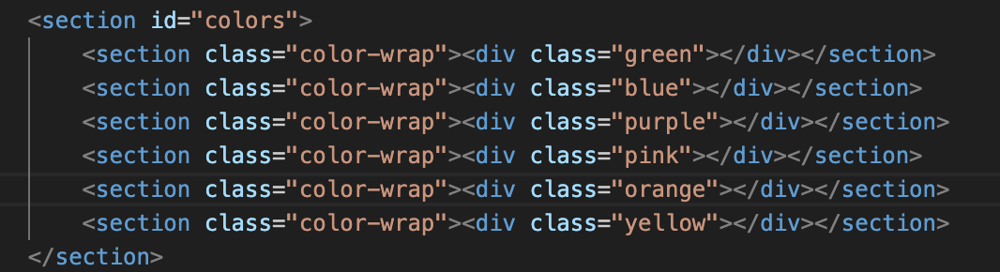

# Sarah Ganz SEI-Project 1-Mastermind

## Game Description - Mastermind
Mastermind or Master Mind is a code-breaking game for two players invented in Israel. It resembles an earlier pencil and paper game called Bulls and Cows that may date back a century.
The game was invented in 1970 by Mordecai Meirowitz.
The object of Mastermind is to guess a secret code consisting of a series of 4 colored pegs. Each guess results in feedback narrowing down the possibilities of the code.
In this version of Mastermind the winner is the player who solves the secret code with the least amount of guesses and before the timer runs out.
After each chosen combination of four colors, the player will get feedback according to his choice.
Black border means: it is the right color and right place. White border means: it is the right color but on the wrong place. No border means: it is the wrong color and wrong place.

## Game pictures

This is how the game is first displayed. Clicking on instructions will bring you to a new tab, displayed in the next image.

This shows you the instructions of the game and an option to watch a youtube video for instructions.

This shows you what happens after clicking PLAY on the main page. The timer of 60 seconds will start running and the color options will be displayed. 

This shows that after choosing the four color options by clicking on them, the borders around the circles on the board will be displayed to give you the feedback.

This shows you when you have found teh color combination in time so you have won. 

This shows you when you have failed the game by not finding the right combination.

This shows you when you have failed the game because the timer has run out.

## Technologies Used
I used HTML to create the basic display of the game.

I used CSS to style the game.

I used Javascript for the functionality of the game.

## Challenging Code Parts

## Link to Game
https://sarahganz.github.io/project1-mastermind/

## Next Steps
There are a few ideas that I plan on adding to this game.

I would like to add the option of playing the game with a partner so the partner chooses the hidden combination. And that the game would keep track of the players results so that when they choose to finish playing the game, they can compare results.

Having players drag the color buttons to the place they choose in no particlar order.

Having a backwards button, if they wanna change their mind on the last one they submitted or for more than one of the colors.

Having the choice of amount of colors shown which is equal to the level of difficulty.